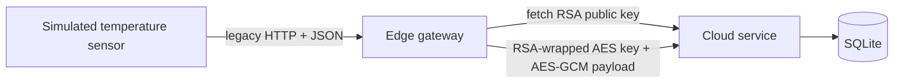

# Legacy Temperature Sensor Edge-Cloud Baseline

This is the intentionally incomplete starting system for a Software Development, Maintenance & Operations course project. A simulated temperature sensor sends JSON readings to an edge gateway. The gateway protects each reading with classical RSA-2048 key transport and AES-GCM, then forwards it to a cloud service that stores it in SQLite.

The baseline is functional, but it is not the final solution. RSA is vulnerable to a sufficiently capable quantum computer, test coverage is deliberately limited, CI only runs the small test suite, and operations support consists of basic console logs and a liveness endpoint. Those gaps are maintenance work to discover, evaluate, and improve with later AI prompts.

## Migration status

Stage 2 is implemented but remains opt-in for review: the cloud is dual-protocol capable, and the gateway supports explicit `rsa` and `mlkem` modes. RSA remains the default until the operator deliberately configures an ML-KEM canary. The cloud publishes an ML-KEM-768 public key at `GET /v2/crypto/public-key`, persists its ML-KEM seed in the cloud data volume, and validates version 2 ML-KEM envelopes. RSA ingestion remains enabled by default for backward compatibility and can be controlled with `ALLOW_RSA_INGEST`.

The cloud never interprets a failed ML-KEM request as permission to retry with RSA. Algorithm selection is explicit in the envelope, and automatic downgrade is not supported.

To prepare an ML-KEM canary, read the cloud's public-key document and copy its 64-character `key_id` into `EXPECTED_MLKEM_KEY_ID`. Then set `CRYPTO_MODE=mlkem` and recreate the gateway. A missing or mismatched key ID causes ML-KEM mode to fail closed; it never invokes the RSA endpoint as a fallback.

### Durable delivery during outages

The gateway now stores each accepted reading in a persistent SQLite outbox before returning HTTP 202. A background worker forwards pending readings with the explicitly configured cryptographic mode and retries HTTP errors with bounded exponential backoff. HTTP 409 is treated as successful delivery because the cloud already stores that `message_id`.

Pending readings survive gateway recreation in `data/gateway-outbox.db`. Changing `CRYPTO_MODE` remains an explicit restart-time decision: after recreation, pending raw readings are encrypted with the newly configured mode. The retry worker never selects RSA or ML-KEM automatically.

The outbox temporarily contains plaintext sensor readings and must therefore be treated as sensitive edge storage. The database file is created with owner-only permissions where the platform supports them and is stored in the local bind-mounted `data` folder.

The sensor retains and retries the same reading and `message_id` while the gateway is unavailable. Outbox state is available at `GET /v1/outbox/status`.

Cloud reading responses distinguish event time from delivery time. `measured_at` is generated by the sensor, `cloud_received_at` records when the cloud stores the reading, and `delivery_delay_seconds` reports the difference. Existing databases are migrated automatically from the former `received_at` column without deleting stored readings.

### Following the message flow

Service logs use searchable `event=<name>` fields and carry the same `message_id` through the sensor, gateway, cryptographic operation, cloud validation, and database write. Key identifiers and selected algorithms are logged, but private keys, shared secrets, derived AES keys, and plaintext payloads are not.

```bash
docker compose logs --follow sensor gateway cloud
```

Copy a `message_id` from `event=reading_sampled` and search for it in later events such as `gateway_reading_received`, `cloud_envelope_received`, `cloud_payload_validated`, and `reading_persisted`.

## Architecture



The gateway generates a random AES-256 key for each reading, encrypts the reading with AES-GCM, and wraps the AES key with the cloud's RSA-2048 public key using OAEP-SHA-256. This is a classical hybrid-encryption baseline that can later be migrated to ML-KEM.

## Quick start with Docker

Requirements: Docker Desktop with Compose.

```bash
docker compose up --build
```

The simulator sends one reading every three seconds. Useful endpoints:

- Latest raw sensor reading: <http://localhost:8002/v1/readings/latest>
- Sensor health: <http://localhost:8002/health>
- Cloud readings: <http://localhost:8000/v1/readings>
- Cloud health: <http://localhost:8000/health>
- Gateway health: <http://localhost:8001/health>

Stop the environment with `docker compose down`. Add `-v` only when you intentionally want to delete the stored readings.

## Local development

Use Python 3.12 or newer.

```bash
python -m venv .venv
# PowerShell: .venv\Scripts\Activate.ps1
# Bash: source .venv/bin/activate
python -m pip install -e ".[dev]"
pytest
```

Run each process in a separate terminal:

```bash
uvicorn temperature_pqc.services.cloud:app --port 8000
uvicorn temperature_pqc.services.gateway:app --port 8001
uvicorn temperature_pqc.services.sensor:app --port 8002
```

Send one manual reading:

```bash
curl -X POST http://localhost:8001/v1/readings \
  -H "Content-Type: application/json" \
  -d '{"sensor_id":"sensor-01","temperature_c":21.5,"measured_at":"2026-09-22T10:00:00Z"}'
```

## Coursework evidence

- [Initial technical documentation](docs/technical-documentation.md)
- [Baseline notes](docs/baseline-and-migration.md)
- [AI-assisted development log](docs/ai-assisted-development-log-{student-name}.md)
- [Seven-week project plan](docs/project-plan.md)

The AI log deliberately marks human review as pending. Group members must run the system, find problems, review generated code, and record what they accept, modify, or reject. Do not use AI to write the individual reflection; the course brief explicitly prohibits that.

## Intentionally incomplete areas

- Classical RSA-2048 key transport is not post-quantum secure.
- Sensor-to-gateway traffic is plaintext.
- Test coverage is limited to a crypto round-trip and one validation rule.
- CI has no linting, security scanning, coverage threshold, image build, or deployment.
- Monitoring has no metrics, dashboards, alerts, or readiness checks.
- Cloud RSA keys are regenerated whenever the process restarts.
- The gateway does not authenticate the public-key response.
- SQLite supports the demo workload, not a distributed production deployment.
